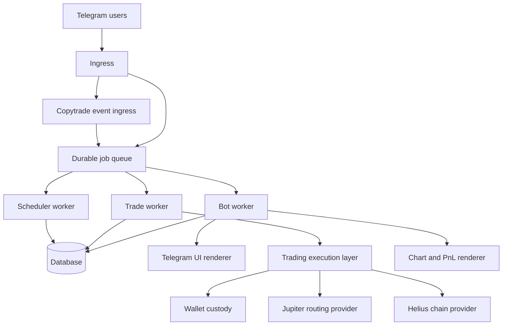

# Architecture

BRO-ker is a Telegram bot backed by a database, provider clients, an execution layer, wallet custody services, chart rendering, and role-based workers.

## Telegram Bot Layer

The bot layer handles commands, callback buttons, text messages, private-chat checks, terms acceptance, rate limits, and user-facing cards.

It renders dashboards for:

- Wallets.
- Portfolio.
- Token trading.
- Limit orders.
- Copytrade.
- Referrals.
- Settings.
- Admin operations.

## Database Layer

The database stores users, wallets, trade quotes, executions, limit orders, copytrade settings and events, referral data, jobs, audit events, and admin actions.

The public docs do not include schema dumps or private production data.

## Provider And API Clients

BRO-ker uses provider clients for:

- Solana chain data and transaction broadcast.
- Token metadata, balances, and pricing.
- Swap quotes and route construction.
- Chart and market data.

Provider keys and full RPC URLs are intentionally not published.

## Trading And Execution Layer

The execution layer builds quotes, validates current settings, prepares transactions, signs with the active wallet, sends transactions, confirms results, records executions, and feeds referral and PnL systems.

Manual trades, copytrades, withdrawals, referral claims, fee sweeps, and limit-order executions are processed as isolated trade-worker jobs.

## Wallet And Custody Layer

Wallet material is encrypted at rest and opened only when signing or exporting is required. Export operations are private-chat only, can be disabled, and are audited.

## Background Workers

BRO-ker can run as separate roles:

| Role | Responsibility |
| --- | --- |
| `ingress` | Accepts Telegram and copytrade webhooks or event streams and enqueues jobs. |
| `bot-worker` | Processes Telegram updates and conversational state. |
| `trade-worker` | Executes swaps, withdrawals, wallet exports, referral claims, fee sweeps, and copytrade jobs. |
| `scheduler-worker` | Schedules limit-order scans and recurring operations. |
| `all` | Local or development mode that runs roles together. |

## Ingress And Webhooks

Ingress can accept Telegram webhooks and copytrade event webhooks. It verifies configured secrets, limits payload size, deduplicates events, and writes jobs to the queue.

Some deployments can use log subscription or streaming-based copytrade ingress instead of webhook delivery.

## Chart Rendering Layer

Chart and PnL renderers create Telegram-ready image cards from tracked execution data, market data, price bars, and wallet position context.

## Referral System

The referral service handles attribution, qualification, reward accrual, claim previews, payout records, and admin reporting.

## Copytrade Pipeline

Copytrade events are normalized into buy or sell intents, matched to users watching the source wallet, filtered through user settings, quoted, executed, and reported through notifications.

