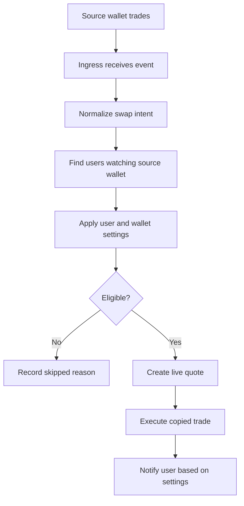

# Copytrading

Copytrading lets users watch selected source wallets and automatically copy eligible buy or sell activity into their BRO-ker wallet.

## Adding Watched Wallets

Users add a source wallet address from the Copy Trade area. Each source wallet can be renamed, enabled, disabled, and opened for per-wallet settings.

New source wallets can use global copytrade settings or custom overrides.

## Settings Overview

Copytrade settings are grouped into practical categories:

| Category | Examples |
| --- | --- |
| Trade mode | Fixed SOL amount or percentage of source trade size. |
| Trade size | Fixed amount, source percentage, min trade size, max trade size. |
| Risk limits | Daily volume cap, daily loss cap, open position cap, max price impact. |
| Execution | Slippage, fee reserve, priority fee mode, tip mode, retry behavior. |
| Buy and sell rules | Copy buys, copy sells, sell mode, max sell percentage. |
| Token filters | Liquidity, market cap, token type, unknown-token handling, route availability. |
| Wallet filters | Source trade min or max size, cooldowns, daily copy counts. |
| Notifications | Skipped, successful, and failed copy alerts. |
| Advanced | Quote age, timeouts, dry run mode, auto-disable after failures. |

## Trade Sizing

BRO-ker can copy using:

- A fixed SOL amount per copied buy.
- A percentage of the source wallet's trade size.
- Sell mirroring or bounded sell percentages, depending on settings.

The final trade may be reduced or skipped by risk limits, fee reserve checks, liquidity requirements, or route availability.

## Common Skip Reasons

Copied trades may be skipped when:

- Copy buys or sells are disabled.
- The source trade is below or above configured size limits.
- The user wallet has no BRO-ker wallet set up.
- Daily volume, daily loss, copy count, or open position limits are reached.
- A sell arrives for a token the user does not hold.
- The route cannot be quoted.
- Price impact exceeds the configured limit.
- Token filters reject the asset.
- Dry run mode is enabled.

## Safety Advice

Copytrading does not remove risk. A source wallet can make mistakes, trade illiquid tokens, or change behavior without warning. Start small, set conservative daily caps, keep fee reserve enabled, and review skipped or failed notifications.

