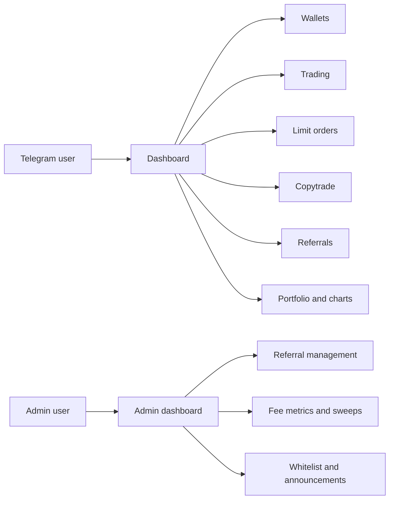

# BRO-ker Bot

BRO-ker Bot is a Telegram trading assistant for Solana spot trading. It brings wallet setup, token discovery, buy and sell flows, local limit orders, copytrading, referrals, portfolio views, and chart cards into a Telegram-native interface.

The bot is designed for people who want a fast chat-based workflow without losing visibility into what they are doing. Users can open a dashboard, fund a trading wallet, paste a token mint, review a live quote, and confirm an on-chain transaction from the same conversation.

!!! warning "Trading risk"
    Crypto trading is risky. Token prices can move quickly, liquidity can disappear, and transactions are irreversible once confirmed on-chain. BRO-ker provides tools and information, but every user is responsible for their own decisions, wallet security, and trade outcomes.

## Main Features

| Area | What it does |
| --- | --- |
| Wallets | Create, manage, back up, and withdraw from BRO-ker trading wallets. |
| Trading | Paste a Solana mint, inspect token data, fetch live buy or sell quotes, and confirm swaps. |
| Selling | Sell by preset percentages, custom size, or an initial-principal style shortcut when available. |
| Limit orders | Save local buy or sell orders that only execute after a live route can satisfy the target. |
| Copytrading | Watch selected source wallets and copy eligible buys or sells using user-defined risk controls. |
| Referrals | Share referral links, track referred activity, and claim available rewards when enabled. |
| Charts and PnL | Generate chart cards, PnL cards, entry and exit overlays, and portfolio views. |
| Admin tools | Manage referral links, whitelist access, platform fee sweeps, metrics, and announcements. |

## Who It Is For

BRO-ker is useful for:

- Users who prefer Telegram-first trading workflows.
- Community members who want quick access to portfolio, PnL, and chart summaries.
- Copytraders who need per-wallet limits and skip rules.
- Admins and support staff managing referrals, access, and operational health.
- Developers reviewing the high-level architecture of a private bot codebase.

## Supported Flows

The public docs explain the product behavior and architecture without exposing private source code, private infrastructure, secrets, or implementation details that could weaken the production system.

## Start Here

- New users: [Getting Started](getting-started.md)
- Full product walkthrough: [User Guide](user-guide.md)
- Command reference: [Commands](commands.md)
- Trading details: [Trading Flow](trading-flow.md)
- Wallet safety: [Wallet and Custody](wallet-and-custody.md)
- Admin operations: [Admin Guide](admin-guide.md)

