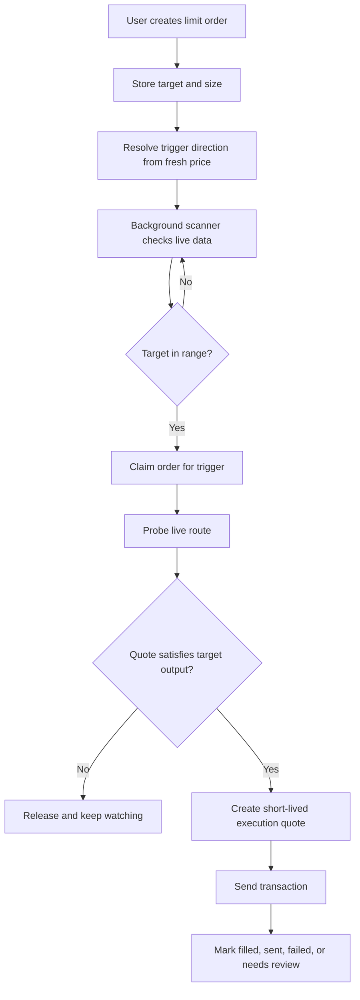

# Limit Orders

BRO-ker limit orders are local bot-managed orders. They are not published as standing on-chain orders. The bot watches market conditions and only requests a live executable quote when a target is in range.

## Take Profit And Stop Loss

BRO-ker can represent both take-profit and stop-loss style behavior through target direction:

- A target above the current price watches for price moving up.
- A target below the current price watches for price moving down.

This means the same limit-order engine can handle TP above entry, SL below entry, and SL-in-profit scenarios.

## Trigger Logic

When an order is created, BRO-ker compares the target to a fresh current price and stores whether the trigger should fire at or above the target, or at or below the target.

That direction matters because a sell target above current price is a take profit, while a sell target below current price is a stop loss. If a stop loss is moved above entry after a token has risen, it behaves like a protective profit stop.

## Why Final Execution Must Use A Fresh Quote

Cached prices are useful for screening, but they are not enough for execution. A final swap must be based on a live route that can satisfy the saved output target.

BRO-ker performs a route probe after the trigger condition is reached. If the live route cannot meet the target output, the order is released and continues watching instead of executing a worse trade.

## Common Scenarios

| Scenario | Behavior |
| --- | --- |
| Stop loss below entry | Trigger direction is below or equal. The order watches for price weakness. |
| Stop loss in profit | If the target is above entry but below current price at the time it is set, it still watches for a move down to that target. |
| Take profit above entry | Trigger direction is above or equal. The order watches for price strength. |
| Instant trigger prevention | Direction is resolved against fresh price at order creation so intent is explicit. A final route still must satisfy target output. |
| Order cancellation | Users can remove active orders from the token limit view or Limit Dash. |
| Wallet changed | If the wallet that created the order is no longer active, the bot can stop watching the order and notify the user. |

## Order Statuses

| Status | Meaning |
| --- | --- |
| Watching | Order is active and waiting for target conditions. |
| Triggering | Order was claimed for execution. |
| Filled | Swap was confirmed and the order is complete. |
| Sent | Swap was broadcast, but confirmation was still pending. |
| Needs Review | Execution failed or the order requires user attention. |
| Cancelled | User removed the order. |

