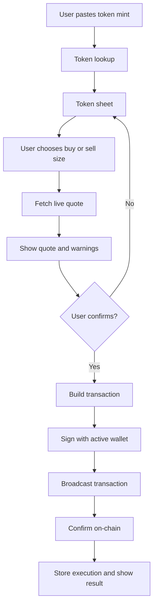

# Trading Flow

BRO-ker uses a quote-first trading flow. Users do not send transactions blindly. They choose an action, BRO-ker fetches current market data and a live route, then the user reviews the result before execution.

## Token Lookup

When a user sends a Solana mint address, BRO-ker loads token metadata, price data, market cap when available, balance information for the active wallet, and any tracked position data.

If a token is unsupported, missing required metadata, or blocked by safety checks, execution controls may be disabled.

## Quote Fetching

For buy and sell actions, BRO-ker requests a fresh route from the configured trading provider. Quotes include:

- Input and output mints.
- Input size.
- Expected output size.
- Slippage settings.
- Price impact.
- Route labels or venue hints.
- Platform fee metadata when enabled.
- Expiration time.

Quotes are short-lived. If a quote expires, users should refresh it instead of trying to execute stale data.

## Route Selection

BRO-ker can use the normal aggregator route and may use specialized routing for supported token types. Route selection is handled by the private execution layer. Public docs intentionally do not expose route-building internals.

## Slippage

Slippage is the maximum tolerated difference between the quoted output and the minimum acceptable output. Higher slippage can make a trade more likely to execute, but it can also accept a worse price.

User settings can define buy slippage, sell slippage, and maximum price impact warnings. Limit-order execution handles target output differently because the order must still satisfy its saved target.

## Transaction Building

After confirmation, BRO-ker prepares the swap transaction, applies network fee preferences, signs with the active wallet, and submits it to the configured broadcast path.

## Confirmation

The result message can report:

| Result | Meaning |
| --- | --- |
| Confirmed | The transaction was confirmed on-chain and execution data was saved. |
| Sent | The transaction was broadcast but final confirmation was still pending. |
| Failed | BRO-ker could not complete the trade or the transaction failed. |

## Position Tracking

Confirmed executions are stored and used for portfolio, token sheet, referral, PnL, chart, and limit-order context. PnL cards only include BRO-ker tracked trades.

## Error Handling

Common trade failures include:

- Quote expired.
- Route no longer available.
- Slippage exceeded.
- Price impact too high.
- Wallet has insufficient SOL or token balance.
- Provider returned a rate limit or temporary error.
- Transaction was too large for the selected route.
- Confirmation timed out.

User-facing errors are sanitized so secrets and provider credentials are not shown.

