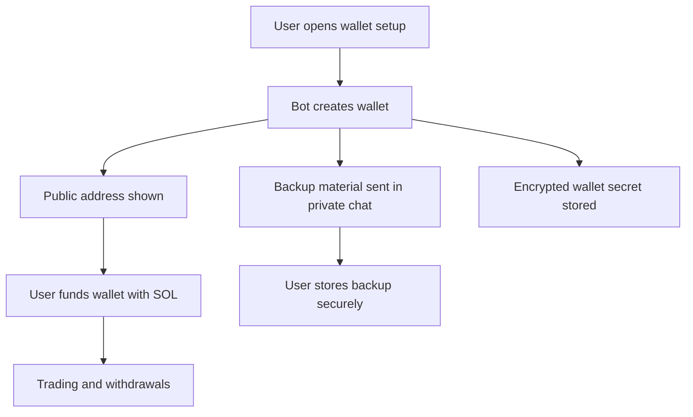

# Wallet And Custody

BRO-ker uses an in-bot trading wallet model. Users interact with a Solana wallet through Telegram, while the bot prepares and submits transactions the user chooses inside the bot.

## Wallet Creation And Management

The reviewed implementation supports generated Solana wallets and multiwallet management. Users can create a main wallet, add more wallets, rename wallets, set a main wallet, export backups when enabled, and withdraw SOL or tokens.

## Custody Model

BRO-ker stores wallet signing material in encrypted form so it can sign user-approved transactions. This is not the same as a browser wallet where the private key only lives on the user's device.

Users should treat BRO-ker as an assisted trading wallet and should keep only the funds they intend to use through the bot.

## Encrypted Storage Concept

Wallet secrets are stored as encrypted envelopes. The private implementation includes integrity checks and support for secret rotation. Public docs do not include encryption payloads, keys, raw envelopes, or database rows.

## Private Key Handling

Users may be shown backup material in private chat during wallet setup or export flows when export is enabled. Exports are sensitive and may be rate-limited, audited, and restricted to private chat.

!!! danger "Backup responsibility"
    If you lose access to Telegram, your device, the bot, or the hosting service, your backup may be the only way to recover funds. Store it offline or in a trusted password manager.

## What Users Should Never Share

Never share:

- Seed phrases.
- Private keys.
- Telegram login codes.
- Screenshots of wallet backup messages.
- Links that expose session access.
- Any message claiming to be support and asking for wallet secrets.

## Withdrawals

BRO-ker supports private-chat withdrawal review flows for SOL and token balances. Always verify the destination wallet and amount before confirming. On-chain transfers cannot be reversed by BRO-ker after confirmation.

